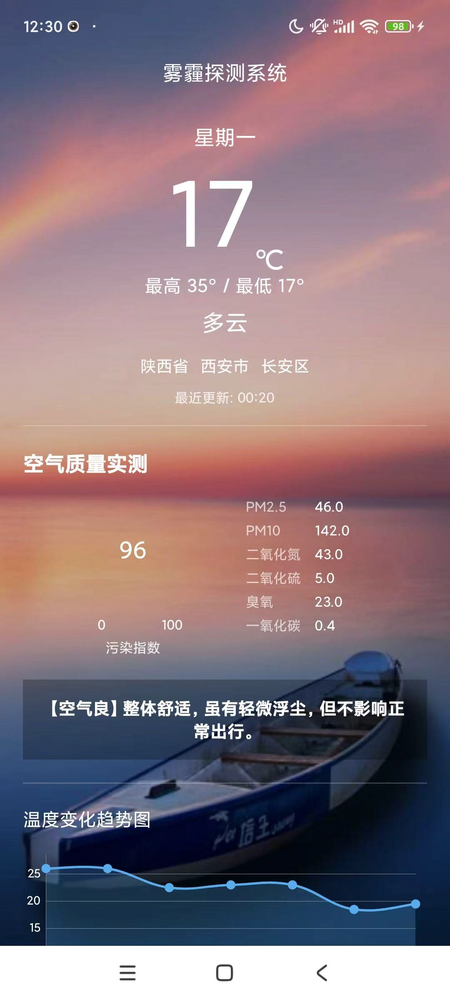
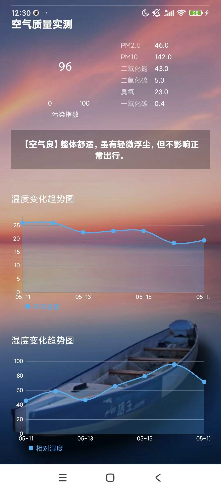

# Smog_Detection_System (雾霾探测系统)
一款基于 Android 原生开发的智能空气质量监测与气象预报应用，旨在为用户提供精准的雾霾探测、数据可视化及个性化的健康防护建议。

---

## 1. 项目简介
本项目针对城市雾霾污染问题，通过集成 **百度地图 LBS 定位服务** 与 **和风天气 QWeather V7 高精度 API**，实现实时定位、气象实况、空气质量监测。
系统核心亮点为**AQI+气温多因子智能建议模型**，自动根据污染等级与实时温度，生成防霾、穿衣、出行一体化防护建议，同时借助 MPAndroidChart 实现七日气象数据可视化。

## 2. 核心功能
- **高精度定位**：基于百度地图 SDK，获取经纬度与省市区三级行政区划
- **气象实况监测**：实时展示气温、天气状况、更新时间、每日温差
- **空气质量矩阵**：支持 AQI 指数、PM2.5、PM10、SO2、NO2、O3、CO 六大污染物展示
- **多因子智能防护建议**：AQI 等级 + 气温区间交叉判断，动态生成防护文案
- **数据可视化**：MPAndroidChart 绘制未来7日温湿度变化曲线

## 3. 开发环境
- Android Studio：Arctic Fox (2020.3.1) 及以上
- JDK：1.8
- Gradle：3.6.2
- MinSDK：API 21 (Android 5.0)

## 4. 项目部署运行
1. 克隆项目到本地
```bash
git clone https://github.com/你的用户名/Smog_Detection_System.git
```
2. Android Studio 选择 Open 导入项目
3. 配置密钥
   - 在 `MainActivity.java` 配置和风天气 `MY_KEY`
   - 在 `AndroidManifest.xml` 配置百度地图 `API_KEY`
4. 真机运行，开启 GPS 定位与网络权限

---

## 5. 核心技术实现

### 5.1 百度地图 SDK 集成与定位配置
#### 5.1.1 清单文件密钥配置
在 `AndroidManifest.xml` 中添加百度地图密钥：
```xml
<meta-data
    android:name="com.baidu.lbsapi.API_KEY"
    android:value="你的百度地图开发者密钥" />
```

#### 5.1.2 定位参数配置
采用高精度定位模式，返回百度坐标系经纬度，用于对接和风天气接口：
```java
LocationClientOption option = new LocationClientOption();
// 高精度定位模式
option.setLocationMode(LocationClientOption.LocationMode.Hight_Accuracy);
// 返回详细地址信息
option.setIsNeedAddress(true);
mLocationClient.setLocOption(option);
```

### 5.2 和风天气 V7 接口封装
#### 5.2.1 接口 URL 拼接逻辑
通过百度地图返回的**经纬度**拼接请求地址，精准获取对应城市气象与空气质量数据：
```java
private String getUrl(double lon, double lat, String type) {
    String baseUrl = "https://devapi.qweather.com/v7/";
    return baseUrl + type + "/now?location=" + lon + "," + lat + "&key=" + MY_KEY;
}
```

#### 5.2.2 OkHttp 异步网络请求 + FastJSON 解析
子线程请求网络，解析 JSON 后切换主线程更新 UI：
```java
OkHttpClient client = new OkHttpClient();
Request request = new Request.Builder().url(apiUrl).build();
client.newCall(request).enqueue(new Callback() {
    @Override
    public void onResponse(Call call, Response response) throws IOException {
        String res = response.body().string();
        JSONObject data = JSON.parseObject(res);
        // 主线程更新 UI
        runOnUiThread(() -> {
            // 赋值气温、AQI、污染物数据
        });
    }
});
```

### 5.3 智能防护决策算法
结合 AQI 污染等级与实时气温，分级生成个性化建议：
```java
private void updateAirAndAdvice(String aqiData) {
        if (aqiData == null || aqiData.isEmpty()) aqiData = "0";
        float aqiVal = Float.parseFloat(aqiData);
        rpbAqi.setMaxProgress(300);
        rpbAqi.setProgress(aqiVal);
        rpbAqi.setFirstText(aqiData);

        // 获取当前温度
        String tempStr = mtemp.getText().toString().replace("°C", "").trim();
        float currentTemp = 22; // 默认舒适温度
        try {
            currentTemp = Float.parseFloat(tempStr);
        } catch (Exception e) { e.printStackTrace(); }

        String advice = "";
        int aqiInt = (int) aqiVal;

        // --- 第一层：判断空气质量 ---
        if (aqiInt <= 50) {
            advice = "【空气优】";
            // 第二层：结合气温给穿衣/出行建议
            if (currentTemp < 10) advice += "空气清新，但天气寒冷，建议穿羽绒服或厚大衣，谨防感冒。";
            else if (currentTemp > 28) advice += "天气晴朗，气温较高，外出请着短袖并注意防晒补水。";
            else advice += "气候宜人，空气纯净，是户外运动的绝佳时机！";

        } else if (aqiInt <= 100) {
            advice = "【空气良】";
            if (currentTemp < 10) advice += "空气质量尚可，体感偏冷，外出请加强保暖，并避开晨间雾气。";
            else if (currentTemp > 28) advice += "气温较高，建议穿着轻便透气衣物。敏感人群室外活动请适度。";
            else advice += "整体舒适，虽有轻微浮尘，但不影响正常出行。";

        } else if (aqiInt <= 200) {
            advice = "【轻中度污染】";
            if (currentTemp < 10) advice += "雾霾来袭且伴随低温，请佩戴N95口罩，穿厚外套，减少冷空气对呼吸道刺激。";
            else if (currentTemp > 28) advice += "高温且有霾，空气闷热，建议减少剧烈运动，尽量留在室内开启空调。";
            else advice += "空气质量较差，建议佩戴防护口罩，回家后及时清洗口鼻。";

        } else {
            advice = "【重度雾霾】";
            // 重度污染时，首要建议是保护呼吸道，无论气温如何
            if (currentTemp < 0) advice += "极寒且重度污染！非必要不出门。若必须外出，务必全副武装：防霾口罩+厚羽绒服。";
            else advice += "空气质量极差，请关闭门窗，开启净化器，避免一切户外锻炼！";
        }

        // 更新 UI
        if (mAdviceTextView != null) {
            mAdviceTextView.setText(advice);
        }
    }
```

---

## 6. 结果演示



## 7. 参考资料
- https://github.com/zstar1003/Weather_App/blob/master/README.md
- https://blog.csdn.net/qq1198768105/article/details/125130786
- https://blog.csdn.net/zggq323/article/details/147223798
- 百度地图Android定位SDK官方文档
- 和风天气QWeather V7开发文档

## 8. 贡献指南
欢迎提交 Issue 与 Pull Request，共同完善项目功能。
```
